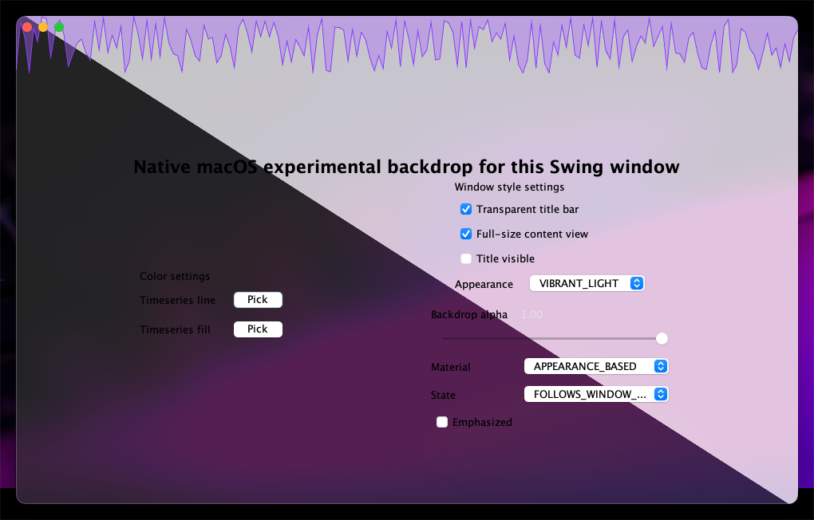
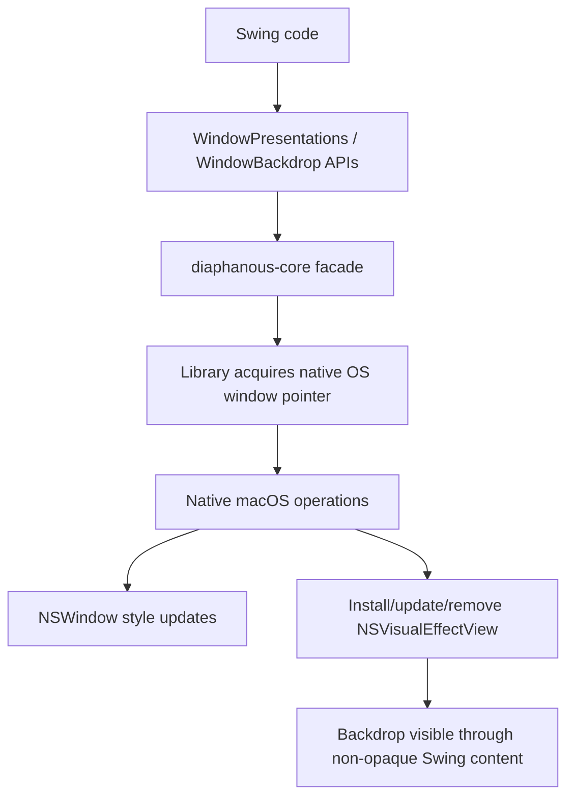

# Diaphanous Swing

`diaphanous-swing` is a Java library to apply native translucency/backdrop and window decoration styles to Swing/AWT windows.

<div align="center"> 
  
</div>

> [!NOTE]
> At this time only macOs support has been implemented.

> [!NOTE]
> Note this library requires running native code, and as such requires the flag `--enable-native-access=ALL-UNNAMED` to be set. 

## Library usage

```java
import io.github.bric3.diaphanous.backdrop.MacosBackdropEffectSpec;
import io.github.bric3.diaphanous.backdrop.MacosBackdropEffectSpec.MacosBackdropMaterial;
import io.github.bric3.diaphanous.backdrop.WindowBackgroundEffectSpec;
import io.github.bric3.diaphanous.backdrop.WindowBackdrop;
import io.github.bric3.diaphanous.decorations.MacosWindowAppearanceSpec;
import io.github.bric3.diaphanous.decorations.MacosWindowDecorationsSpec;
import io.github.bric3.diaphanous.decorations.WindowPresentations;

MacosWindowDecorationsSpec style = MacosWindowDecorationsSpec.builder()
    .transparentTitleBar(true)
    .fullSizeContentView(true)
    .titleVisible(false)
    .build();
WindowPresentations.applyDecorations(frame, style);

WindowBackgroundEffectSpec vibrancy = MacosBackdropEffectSpec.builder()
    .material(MacosBackdropMaterial.UNDER_WINDOW_BACKGROUND)
    .build();
WindowBackdrop.apply(frame, vibrancy);

WindowPresentations.applyAppearance(frame, MacosWindowAppearanceSpec.SYSTEM);
```

> [!IMPORTANT]
> To be able to observe bckdrop effects, the swing components **MUST** be non-opaque 
> (`setOpaque(false)`), also the window content pane must forcingly be transparent, see 
> `io.github.bric3.diaphanous.backdrop.RootErasingContentPane` and 
> `io.github.bric3.diaphanous.backdrop.ComponentBackdropSupport`.


> [!NOTE]
> On macOs it has been observed there might be a delay between the backdrop is effectively 
> changed, this unfortunately shows a white background. At this point I didn't found any 
> correct fix. However, there is now a workaround that delays the visibility of the window with `WindowRevealController.show(frame)`.

## What's actually happening under the hood.

### macOS

At a high level, this library does two things for Swing windows on macOS:

1. It updates `NSWindow` style/appearance flags (title bar, full-size content, appearance).
2. It installs/removes an `NSVisualEffectView`-based backdrop behind the AWT host view.

> [!TIP] 
> The `NSWindow` is the real native macOS window behind a `JFrame`.

On the Swing side, content still needs to cooperate (`setOpaque(false)` and transparent content pane) so the native backdrop can actually be visible.



What gets changed natively:

- Window decorations:
  - Transparent title bar (`setTitlebarAppearsTransparent:`)
  - Full-size content view (`setStyleMask:` + `NSWindowStyleMaskFullSizeContentView`)
  - Title visibility (`setTitleVisibility:`)
  - Appearance (`setAppearance:`)
- Window backdrop:
  - `NSVisualEffectView` install/update/remove
  - Material/state/alpha configuration (or default install via `WindowBackdrop.install(...)`)

## Project layout

- `diaphanous-core`: library module.
- `diaphanous-core-macos-native`: macOS native bridge (`NSView` wrapper + effect view management).
- `demo-swing`: sample Swing app using the library.

## Run the demo

Decorated mode:

```bash
./gradlew :demo-swing:run
```

The demo is preconfigured with this JVM argument:

- `--enable-native-access=ALL-UNNAMED`

`diaphanous-core` bundles a simple macOS native library that is loaded it from classpath by default.
For local override/debug, set `-Ddiaphanous.macos.nativeLib=/absolute/path/to/libdiaphanous-core-macos-native.dylib`.

Robot smoke test:

```bash
./gradlew :demo-swing:robotTest
```

## License

Mozilla Public License 2.0 (`MPL-2.0`). See `LICENSE`.
