# Examples

## Decorations

### 001-style-default-modern

Baseline Screenshot


Code snippet

```java
// resetFramePresentation(frame) already applies default decorations + SYSTEM appearance.
```

### 002-style-title-visible

Baseline Screenshot


Code snippet

```java
WindowPresentations.applyDecorations(frame, MacosWindowDecorationsSpec.builder()
    .titleVisible(true)
    .build());
```

### 003-style-opaque-standard

Baseline Screenshot

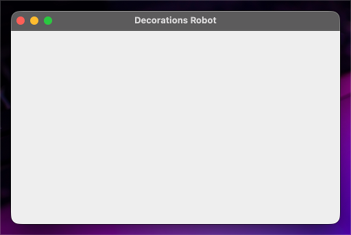

Code snippet

```java
WindowPresentations.applyDecorations(frame, MacosWindowDecorationsSpec.builder()
    .transparentTitleBar(false)
    .fullSizeContentView(false)
    .titleVisible(true)
    .build());
```

### 004-style-transparent-titlebar-only

Baseline Screenshot

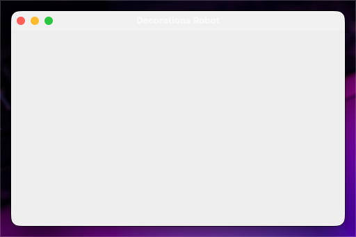

Code snippet

```java
WindowPresentations.applyDecorations(frame, MacosWindowDecorationsSpec.builder()
    .transparentTitleBar(true)
    .fullSizeContentView(false)
    .titleVisible(true)
    .build());
```

### 010-appearance-system-no-backdrop

Baseline Screenshot


Code snippet

```java
WindowPresentations.applyAppearance(frame, MacosWindowAppearanceSpec.SYSTEM);
```

### 011-appearance-aqua-no-backdrop

Baseline Screenshot


Code snippet

```java
WindowPresentations.applyAppearance(frame, MacosWindowAppearanceSpec.AQUA);
```

### 012-appearance-dark-aqua-no-backdrop

Baseline Screenshot


Code snippet

```java
WindowPresentations.applyAppearance(frame, MacosWindowAppearanceSpec.DARK_AQUA);
```

### 013-appearance-vibrant-light-no-backdrop

Baseline Screenshot

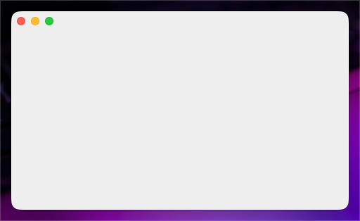

Code snippet

```java
WindowPresentations.applyAppearance(frame, MacosWindowAppearanceSpec.VIBRANT_LIGHT);
```

### 014-appearance-vibrant-dark-no-backdrop

Baseline Screenshot


Code snippet

```java
WindowPresentations.applyAppearance(frame, MacosWindowAppearanceSpec.VIBRANT_DARK);
```

### 020-appearance-system-with-backdrop

Baseline Screenshot


Code snippet

```java
WindowPresentations.applyAppearance(frame, MacosWindowAppearanceSpec.SYSTEM);
installBackdrop(frame);
```

### 021-appearance-aqua-with-backdrop

Baseline Screenshot


Code snippet

```java
WindowPresentations.applyAppearance(frame, MacosWindowAppearanceSpec.AQUA);
installBackdrop(frame);
```

### 022-appearance-dark-aqua-with-backdrop

Baseline Screenshot

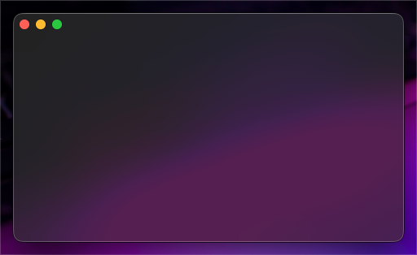

Code snippet

```java
WindowPresentations.applyAppearance(frame, MacosWindowAppearanceSpec.DARK_AQUA);
installBackdrop(frame);
```

### 023-appearance-vibrant-light-with-backdrop

Baseline Screenshot

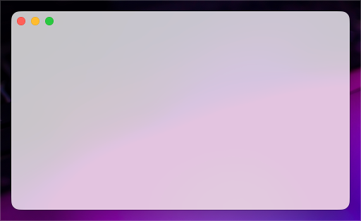

Code snippet

```java
WindowPresentations.applyAppearance(frame, MacosWindowAppearanceSpec.VIBRANT_LIGHT);
installBackdrop(frame);
```

### 024-appearance-vibrant-dark-with-backdrop

Baseline Screenshot


Code snippet

```java
WindowPresentations.applyAppearance(frame, MacosWindowAppearanceSpec.VIBRANT_DARK);
installBackdrop(frame);
```

## Backdrop

### 001-enabled-false

| Light | Dark |
| --- | --- |
| 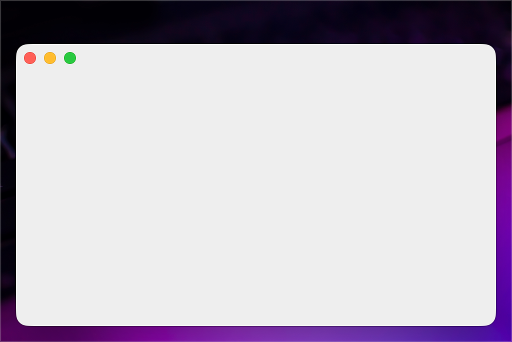 | 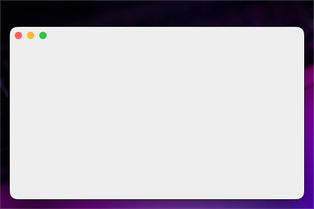 |

Code snippet

```java
WindowBackdrop.apply(frame, MacosBackdropEffectSpec.builder()
    .enabled(false)
    .build());
```

### 010-material-appearance-based

| Light | Dark |
| --- | --- |
| 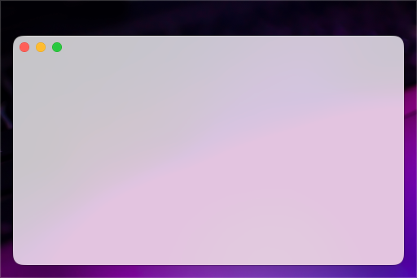 |  |

Code snippet

```java
WindowBackdrop.apply(frame, MacosBackdropEffectSpec.builder()
    .material(MacosBackdropEffectSpec.MacosBackdropMaterial.APPEARANCE_BASED)
    .state(MacosBackdropEffectSpec.MacosBackdropEffectState.FOLLOWS_WINDOW_ACTIVE_STATE)
    .emphasized(false)
    .backdropAlpha(1.0d)
    .build());
```

### 011-material-light

| Light | Dark |
| --- | --- |
| 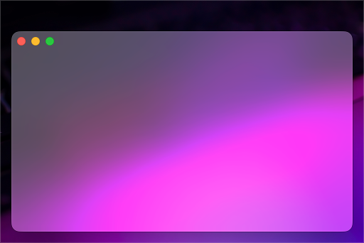 | 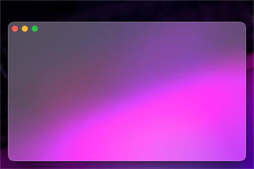 |

Code snippet

```java
WindowBackdrop.apply(frame, MacosBackdropEffectSpec.builder()
    .material(MacosBackdropEffectSpec.MacosBackdropMaterial.LIGHT)
    .state(MacosBackdropEffectSpec.MacosBackdropEffectState.FOLLOWS_WINDOW_ACTIVE_STATE)
    .emphasized(false)
    .backdropAlpha(1.0d)
    .build());
```

### 012-material-dark

| Light | Dark |
| --- | --- |
| 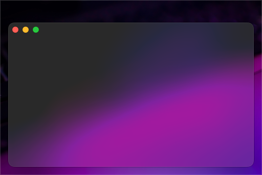 | 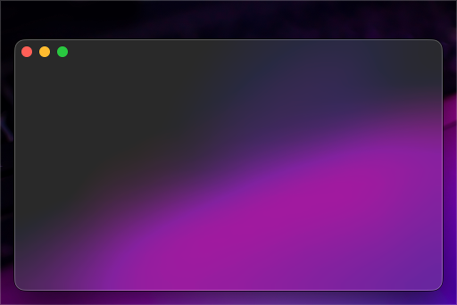 |

Code snippet

```java
WindowBackdrop.apply(frame, MacosBackdropEffectSpec.builder()
    .material(MacosBackdropEffectSpec.MacosBackdropMaterial.DARK)
    .state(MacosBackdropEffectSpec.MacosBackdropEffectState.FOLLOWS_WINDOW_ACTIVE_STATE)
    .emphasized(false)
    .backdropAlpha(1.0d)
    .build());
```

### 013-material-titlebar

| Light | Dark |
| --- | --- |
| 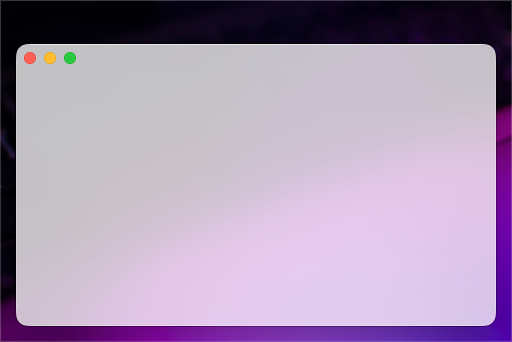 | 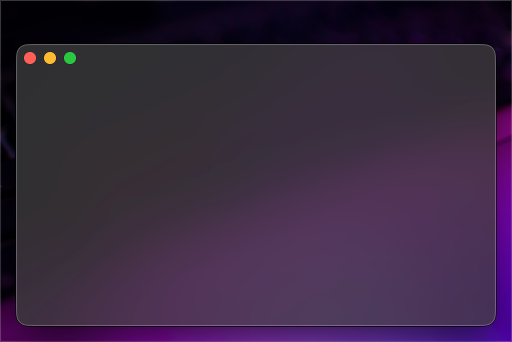 |

Code snippet

```java
WindowBackdrop.apply(frame, MacosBackdropEffectSpec.builder()
    .material(MacosBackdropEffectSpec.MacosBackdropMaterial.TITLEBAR)
    .state(MacosBackdropEffectSpec.MacosBackdropEffectState.FOLLOWS_WINDOW_ACTIVE_STATE)
    .emphasized(false)
    .backdropAlpha(1.0d)
    .build());
```

### 014-material-selection

| Light | Dark |
| --- | --- |
| 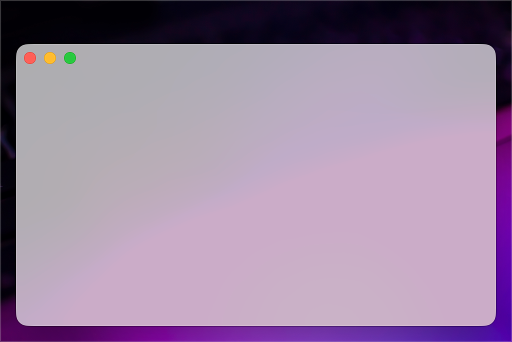 | 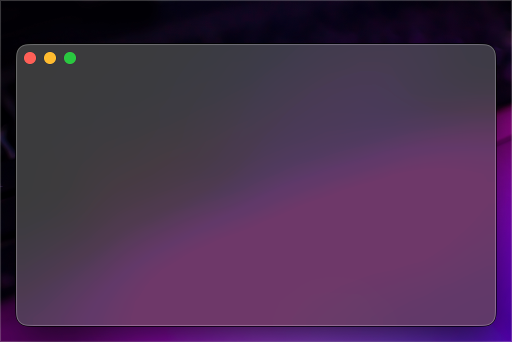 |

Code snippet

```java
WindowBackdrop.apply(frame, MacosBackdropEffectSpec.builder()
    .material(MacosBackdropEffectSpec.MacosBackdropMaterial.SELECTION)
    .state(MacosBackdropEffectSpec.MacosBackdropEffectState.FOLLOWS_WINDOW_ACTIVE_STATE)
    .emphasized(false)
    .backdropAlpha(1.0d)
    .build());
```

### 015-material-menu

| Light | Dark |
| --- | --- |
| 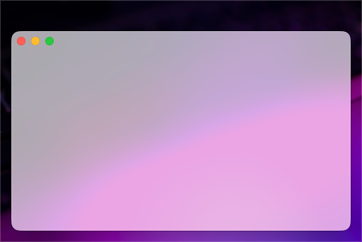 | 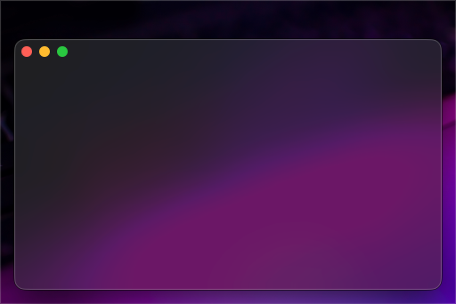 |

Code snippet

```java
WindowBackdrop.apply(frame, MacosBackdropEffectSpec.builder()
    .material(MacosBackdropEffectSpec.MacosBackdropMaterial.MENU)
    .state(MacosBackdropEffectSpec.MacosBackdropEffectState.FOLLOWS_WINDOW_ACTIVE_STATE)
    .emphasized(false)
    .backdropAlpha(1.0d)
    .build());
```

### 016-material-popover

| Light | Dark |
| --- | --- |
| 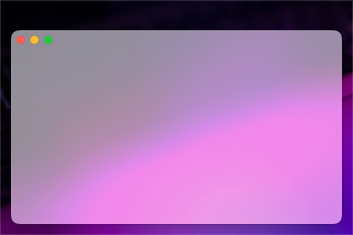 | 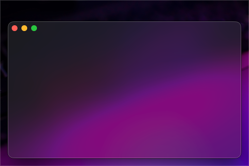 |

Code snippet

```java
WindowBackdrop.apply(frame, MacosBackdropEffectSpec.builder()
    .material(MacosBackdropEffectSpec.MacosBackdropMaterial.POPOVER)
    .state(MacosBackdropEffectSpec.MacosBackdropEffectState.FOLLOWS_WINDOW_ACTIVE_STATE)
    .emphasized(false)
    .backdropAlpha(1.0d)
    .build());
```

### 017-material-sidebar

| Light | Dark |
| --- | --- |
|  |  |

Code snippet

```java
WindowBackdrop.apply(frame, MacosBackdropEffectSpec.builder()
    .material(MacosBackdropEffectSpec.MacosBackdropMaterial.SIDEBAR)
    .state(MacosBackdropEffectSpec.MacosBackdropEffectState.FOLLOWS_WINDOW_ACTIVE_STATE)
    .emphasized(false)
    .backdropAlpha(1.0d)
    .build());
```

### 018-material-header-view

| Light | Dark |
| --- | --- |
|  | 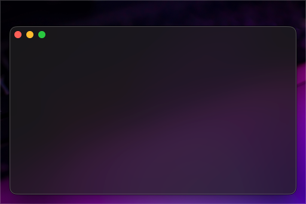 |

Code snippet

```java
WindowBackdrop.apply(frame, MacosBackdropEffectSpec.builder()
    .material(MacosBackdropEffectSpec.MacosBackdropMaterial.HEADER_VIEW)
    .state(MacosBackdropEffectSpec.MacosBackdropEffectState.FOLLOWS_WINDOW_ACTIVE_STATE)
    .emphasized(false)
    .backdropAlpha(1.0d)
    .build());
```

### 019-material-sheet

| Light | Dark |
| --- | --- |
|  | 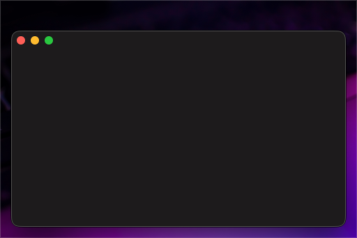 |

Code snippet

```java
WindowBackdrop.apply(frame, MacosBackdropEffectSpec.builder()
    .material(MacosBackdropEffectSpec.MacosBackdropMaterial.SHEET)
    .state(MacosBackdropEffectSpec.MacosBackdropEffectState.FOLLOWS_WINDOW_ACTIVE_STATE)
    .emphasized(false)
    .backdropAlpha(1.0d)
    .build());
```

### 020-material-window-background

| Light | Dark |
| --- | --- |
| 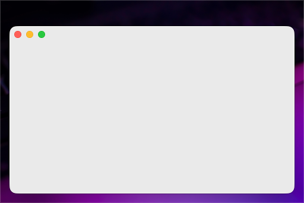 | 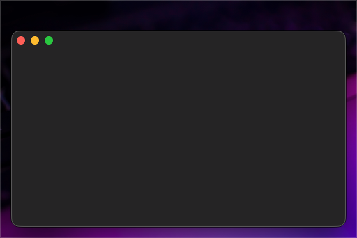 |

Code snippet

```java
WindowBackdrop.apply(frame, MacosBackdropEffectSpec.builder()
    .material(MacosBackdropEffectSpec.MacosBackdropMaterial.WINDOW_BACKGROUND)
    .state(MacosBackdropEffectSpec.MacosBackdropEffectState.FOLLOWS_WINDOW_ACTIVE_STATE)
    .emphasized(false)
    .backdropAlpha(1.0d)
    .build());
```

### 021-material-hud-window

| Light | Dark |
| --- | --- |
| 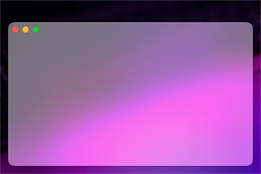 | 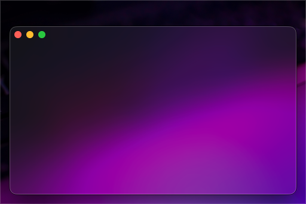 |

Code snippet

```java
WindowBackdrop.apply(frame, MacosBackdropEffectSpec.builder()
    .material(MacosBackdropEffectSpec.MacosBackdropMaterial.HUD_WINDOW)
    .state(MacosBackdropEffectSpec.MacosBackdropEffectState.FOLLOWS_WINDOW_ACTIVE_STATE)
    .emphasized(false)
    .backdropAlpha(1.0d)
    .build());
```

### 022-material-full-screen-ui

| Light | Dark |
| --- | --- |
| 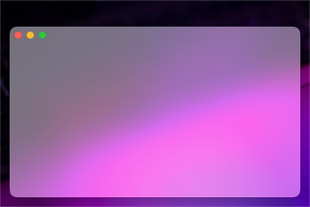 | 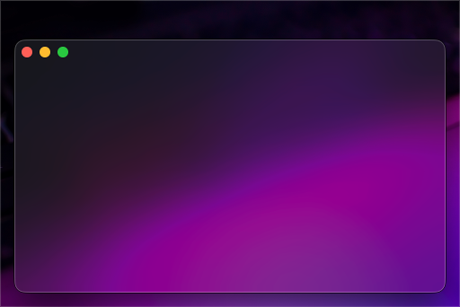 |

Code snippet

```java
WindowBackdrop.apply(frame, MacosBackdropEffectSpec.builder()
    .material(MacosBackdropEffectSpec.MacosBackdropMaterial.FULL_SCREEN_UI)
    .state(MacosBackdropEffectSpec.MacosBackdropEffectState.FOLLOWS_WINDOW_ACTIVE_STATE)
    .emphasized(false)
    .backdropAlpha(1.0d)
    .build());
```

### 023-material-tooltip

| Light | Dark |
| --- | --- |
|  |  |

Code snippet

```java
WindowBackdrop.apply(frame, MacosBackdropEffectSpec.builder()
    .material(MacosBackdropEffectSpec.MacosBackdropMaterial.TOOLTIP)
    .state(MacosBackdropEffectSpec.MacosBackdropEffectState.FOLLOWS_WINDOW_ACTIVE_STATE)
    .emphasized(false)
    .backdropAlpha(1.0d)
    .build());
```

### 024-material-content-background

| Light | Dark |
| --- | --- |
|  |  |

Code snippet

```java
WindowBackdrop.apply(frame, MacosBackdropEffectSpec.builder()
    .material(MacosBackdropEffectSpec.MacosBackdropMaterial.CONTENT_BACKGROUND)
    .state(MacosBackdropEffectSpec.MacosBackdropEffectState.FOLLOWS_WINDOW_ACTIVE_STATE)
    .emphasized(false)
    .backdropAlpha(1.0d)
    .build());
```

### 025-material-under-window-background

| Light | Dark |
| --- | --- |
|  |  |

Code snippet

```java
WindowBackdrop.apply(frame, MacosBackdropEffectSpec.builder()
    .material(MacosBackdropEffectSpec.MacosBackdropMaterial.UNDER_WINDOW_BACKGROUND)
    .state(MacosBackdropEffectSpec.MacosBackdropEffectState.FOLLOWS_WINDOW_ACTIVE_STATE)
    .emphasized(false)
    .backdropAlpha(1.0d)
    .build());
```

### 026-material-under-page-background

| Light | Dark |
| --- | --- |
|  | 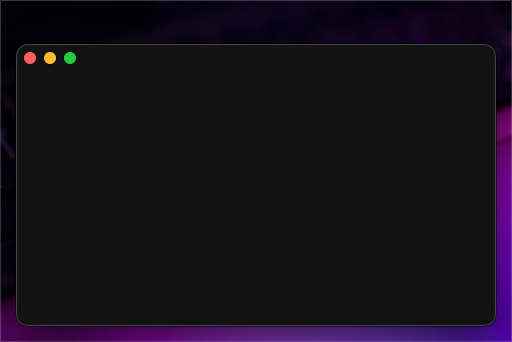 |

Code snippet

```java
WindowBackdrop.apply(frame, MacosBackdropEffectSpec.builder()
    .material(MacosBackdropEffectSpec.MacosBackdropMaterial.UNDER_PAGE_BACKGROUND)
    .state(MacosBackdropEffectSpec.MacosBackdropEffectState.FOLLOWS_WINDOW_ACTIVE_STATE)
    .emphasized(false)
    .backdropAlpha(1.0d)
    .build());
```

### 100-state-follows-active

| Light | Dark |
| --- | --- |
|  | 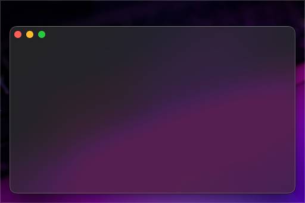 |

Code snippet

```java
WindowBackdrop.apply(frame, MacosBackdropEffectSpec.builder()
    .material(MacosBackdropEffectSpec.MacosBackdropMaterial.UNDER_WINDOW_BACKGROUND)
    .state(MacosBackdropEffectSpec.MacosBackdropEffectState.FOLLOWS_WINDOW_ACTIVE_STATE)
    .build());
```

### 101-state-active

| Light | Dark |
| --- | --- |
|  |  |

Code snippet

```java
WindowBackdrop.apply(frame, MacosBackdropEffectSpec.builder()
    .material(MacosBackdropEffectSpec.MacosBackdropMaterial.UNDER_WINDOW_BACKGROUND)
    .state(MacosBackdropEffectSpec.MacosBackdropEffectState.ACTIVE)
    .build());
```

### 102-state-inactive

| Light | Dark |
| --- | --- |
| 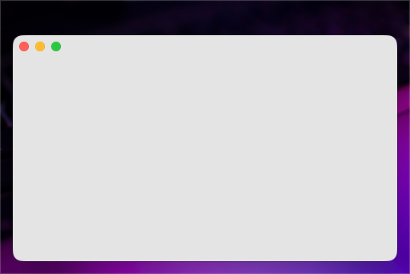 |  |

Code snippet

```java
WindowBackdrop.apply(frame, MacosBackdropEffectSpec.builder()
    .material(MacosBackdropEffectSpec.MacosBackdropMaterial.UNDER_WINDOW_BACKGROUND)
    .state(MacosBackdropEffectSpec.MacosBackdropEffectState.INACTIVE)
    .build());
```

### 110-sidebar-emphasis-false

| Light | Dark |
| --- | --- |
|  |  |

Code snippet

```java
WindowBackdrop.apply(frame, MacosBackdropEffectSpec.builder()
    .material(MacosBackdropEffectSpec.MacosBackdropMaterial.SIDEBAR)
    .state(MacosBackdropEffectSpec.MacosBackdropEffectState.ACTIVE)
    .emphasized(false)
    .build());
```

### 111-sidebar-emphasis-true

| Light | Dark |
| --- | --- |
|  |  |

Code snippet

```java
WindowBackdrop.apply(frame, MacosBackdropEffectSpec.builder()
    .material(MacosBackdropEffectSpec.MacosBackdropMaterial.SIDEBAR)
    .state(MacosBackdropEffectSpec.MacosBackdropEffectState.ACTIVE)
    .emphasized(true)
    .build());
```

### 120-alpha-100

| Light | Dark |
| --- | --- |
| 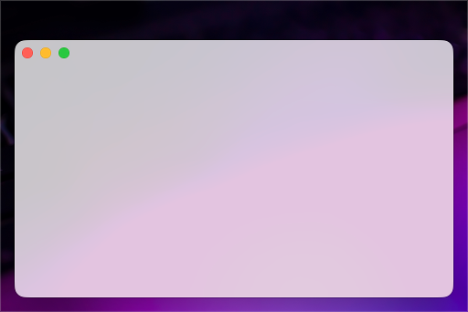 |  |

Code snippet

```java
WindowBackdrop.apply(frame, MacosBackdropEffectSpec.builder()
    .material(MacosBackdropEffectSpec.MacosBackdropMaterial.UNDER_WINDOW_BACKGROUND)
    .state(MacosBackdropEffectSpec.MacosBackdropEffectState.ACTIVE)
    .backdropAlpha(1.0d)
    .build());
```

### 121-alpha-090

| Light | Dark |
| --- | --- |
|  | 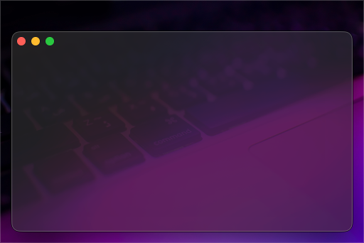 |

Code snippet

```java
WindowBackdrop.apply(frame, MacosBackdropEffectSpec.builder()
    .material(MacosBackdropEffectSpec.MacosBackdropMaterial.UNDER_WINDOW_BACKGROUND)
    .state(MacosBackdropEffectSpec.MacosBackdropEffectState.ACTIVE)
    .backdropAlpha(0.90d)
    .build());
```

### 122-alpha-070

| Light | Dark |
| --- | --- |
|  |  |

Code snippet

```java
WindowBackdrop.apply(frame, MacosBackdropEffectSpec.builder()
    .material(MacosBackdropEffectSpec.MacosBackdropMaterial.UNDER_WINDOW_BACKGROUND)
    .state(MacosBackdropEffectSpec.MacosBackdropEffectState.ACTIVE)
    .backdropAlpha(0.70d)
    .build());
```

### 123-alpha-040

| Light | Dark |
| --- | --- |
|  |  |

Code snippet

```java
WindowBackdrop.apply(frame, MacosBackdropEffectSpec.builder()
    .material(MacosBackdropEffectSpec.MacosBackdropMaterial.UNDER_WINDOW_BACKGROUND)
    .state(MacosBackdropEffectSpec.MacosBackdropEffectState.ACTIVE)
    .backdropAlpha(0.40d)
    .build());
```

