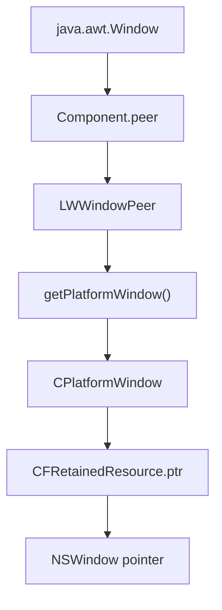

<!--
  Diaphanous Swing

  Copyright (c) 2026 - Brice Dutheil

  This Source Code Form is subject to the terms of the Mozilla Public
  License, v. 2.0. If a copy of the MPL was not distributed with this
  file, You can obtain one at https://mozilla.org/MPL/2.0/.
-->

# Technical Note 001: Inspection of JDK AWT macOS internals

## Problem to Solve

The library goal is to style a Swing window using native macOS `NSWindow` APIs.

To do that safely, two concrete questions needed to be answered first:

1. How to get from `java.awt.Window` to the native `NSWindow*` pointer.
2. How to dispatch native window mutations on the correct macOS thread.

## Why inspecting `sun.lwawt.macosx.*`?

The Swing public API intentionally does not expose Cocoa-level handles or AppKit dispatch primitives.  
At runtime on macOS, those responsibilities are implemented by the JDK's LWAWT macOS backend (`sun.lwawt.macosx.*`).

That package is where the bridge actually exists between:

- Java desktop objects (`Window`, peers, toolkit)
- Cocoa objects (`NSWindow`)
- macOS event-thread integration (AppKit/main-thread scheduling)

Because the library needs native style control without patching the JDK, the least invasive approach is:

1. stay at Swing API level for user-facing entry points;
2. cross once into LWAWT internals only to resolve the native window and perform thread-correct dispatch;
3. perform all style mutations through Objective-C runtime calls.

So the inspection scope was deliberate: identify the narrowest internal touchpoints that already represent the macOS adaptation layer.

## Inspected types

| Type                                  | Why it mattered                                                                          |
|---------------------------------------|------------------------------------------------------------------------------------------|
| `sun.lwawt.macosx.CPlatformWindow`    | Identified macOS window peer implementation and inheritance chain.                       |
| `sun.lwawt.macosx.CFRetainedResource` | Confirmed native pointer storage field (`ptr`) that ultimately references Cocoa objects. |
| `sun.lwawt.LWWindowPeer`              | Confirmed `getPlatformWindow()` entry point from AWT peer to platform peer.              |
| `sun.lwawt.macosx.LWCToolkit`         | Identified available bridging APIs for main-thread dispatch.                             |
| `sun.lwawt.macosx.CThreading`         | Checked as a candidate helper, but class was not available in JDK 25.                    |

## Path forward

1. Pointer resolution path:

2. Threading strategy:
Use `LWCToolkit` main-thread bridge for AppKit-sensitive mutations.

3. Encapsulation flags:
The desktop app will need to`--add-opens` for `java.desktop` packages needed by reflection.
