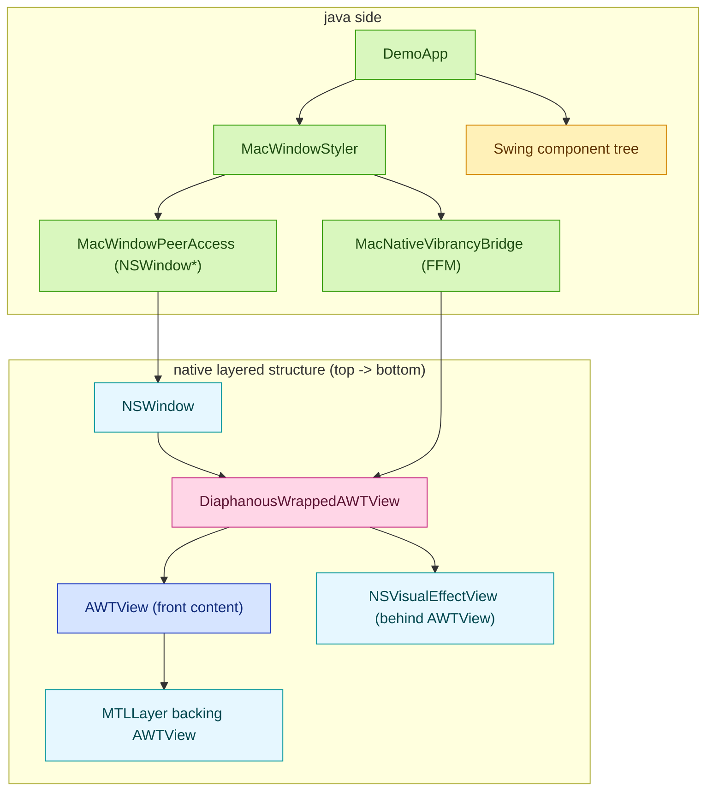

# Decorating with macOs vibrancy

## Summary

A native wrapper path was implemented and verified to insert `NSVisualEffectView` correctly behind the AWT host view in decorated mode.

The window is still rendered as opaque gray in practice.

## Why a native library was introduced?

From the Java side, the first approach was direct Objective-C runtime calls to:

1. resolve `NSWindow*`,
2. toggle `NSWindow`/`NSView` properties,
3. insert `NSVisualEffectView`.

That worked for property updates, but it did not provide a robust way to control native view ownership in decorated AWT windows.

In the native AppKit view hierarchy, the effect view must sit between `NSWindow` and the existing `AWTView` as a sibling-behind arrangement.

With that previous Java-only one-shot call approach, the native structure effectively stayed:

```text
NSWindow
└── contentView: AWTView
```

In this structure, there is no stable parent container that owns both:

1. the original `AWTView` as front content, and
2. the `NSVisualEffectView` as backdrop behind content.

The missing piece is structural:

1. create a stable wrapper around the existing AWT host view,
2. install/remove an effect view under that host view,
3. preserve AWT-specific selector/event behavior on the wrapper boundary.

FFM can handle part of this, but not cleanly for this case.

1. FFM is great for calling C symbols and simple Objective-C runtime functions.
2. This solution needs a real native `NSView` subclass (`DiaphanousWrappedAWTView`) with Objective-C methods (`mouseIsOver`, `deliverJavaMouseEvent:`), lifecycle, and ownership semantics.
3. Doing that from pure FFM would require dynamic Objective-C class creation, method injection with exact Objective-C ABI signatures, and careful upcall/trampoline lifetime handling.
4. A small `.mm` bridge provides stable Objective-C behavior while Java/FFM remains the orchestration layer.

So this is not impossible with FFM; it is possible but significantly higher risk and complex.

## what is now implemented

1. A native macOS helper project (`translucency-core-macos-native`) built with Gradle native support.
2. A native wrapper content view (`DiaphanousWrappedAWTView`) that:
   - wraps the original `AWTView`,
   - inserts `NSVisualEffectView` behind it,
   - forwards AWT mouse selectors.
3. Java FFM bridge (`MacNativeVibrancyBridge`) that calls native install/update/remove functions.


Addtionally two system properties were added to dump the structure:
- `-Ddiaphanous.dump.swing=true`
- `-Ddiaphanous.dump.native=true`

## Structure layout

This is the new component tree:



## Attempted approaches

1. Pure Java insertion:
   - resolved `NSWindow*` from AWT peer,
   - inserted `NSVisualEffectView` as a sibling under `contentView`,
   - applied material/state/alpha.
2. Java-side transparency tuning:
   - made Swing panels non-opaque,
   - cleared Swing panel backgrounds,
   - attempted peer opacity changes from Java.
3. Native wrapper path:
   - replaced `contentView` with `DiaphanousWrappedAWTView`,
   - moved original `AWTView` inside wrapper,
   - inserted `NSVisualEffectView` behind wrapped `AWTView`,
   - set non-opaque/clear background on window, wrapper, and AWT host layers.
4. Runtime dumps:
   - dumped Swing tree opacity/background state,
   - dumped native AppKit hierarchy and layer flags before and after vibrancy install.

## What the hierarchy dump showed

Before install:

- `contentView` was directly `AWTView`.
- window was opaque with default light background.
- `AWTView` had an `MTLLayer`.

After install:

- window became non-opaque with clear background,
- content view switched from `AWTView` to `DiaphanousWrappedAWTView`,
- `NSVisualEffectView` is present,
- wrapped `AWTView` is non-opaque with a clear layer background,
- `AWTView` is still backed by `MTLLayer`.

This confirms The dump confirms the follwing:

1. Native wrapper installation is correct.
2. `NSVisualEffectView` is present and placed behind `AWTView`.
3. Window, wrapper, and `AWTView` are all configured as non-opaque.
4. `AWTView` remains backed by `MTLLayer`, and Swing/AWT still paints a full surface over the backdrop.

So the blocker is no longer native hierarchy setup. The blocker is the decorated AWT rendering pipeline (Metal-backed surface) covering the effect view.

<details>
  <summary>dumped properties (swing + native)</summary>

```text
- JRootPane visible=true opaque=false bg=rgba(238,238,238,255)
  - JLayeredPane visible=true opaque=false bg=rgba(238,238,238,255)
    - JPanel visible=true opaque=false bg=rgba(0,0,0,0)
      - RandomTimeseriesPanel visible=true opaque=false bg=rgba(238,238,238,255)
```

```text
[diaphanous] ---- window dump begin ----
[diaphanous] window=<AWTWindow_Normal ...> opaque=1 styleMask=0xf titlebarTransparent=0 bg=rgba(0.947, 0.947, 0.947, 1.000)
[diaphanous] contentView=<AWTView ...> class=AWTView
- AWTView ... opaque=0 wantsLayer=1 layer=<MTLLayer ...> layerOpaque=1 layerBg=nil
[diaphanous] ---- window dump end ----
```

```text
[diaphanous] ---- window dump begin ----
[diaphanous] window=<AWTWindow_Normal ...> opaque=0 styleMask=0x800f titlebarTransparent=1 bg=rgba(0.000, 0.000, 0.000, 0.000)
[diaphanous] contentView=<DiaphanousWrappedAWTView ...> class=DiaphanousWrappedAWTView
- DiaphanousWrappedAWTView ... opaque=0 wantsLayer=1 layer=<NSViewBackingLayer ...> layerOpaque=0 layerBg=rgba(0.000, 0.000, 0.000, 0.000)
  - NSVisualEffectView ... opaque=0 wantsLayer=0 layer=(null) layerOpaque=0 layerBg=nil
  - AWTView ... opaque=0 wantsLayer=1 layer=<MTLLayer ...> layerOpaque=0 layerBg=rgba(0.000, 0.000, 0.000, 0.000)
[diaphanous] ---- window dump end ----
```
</details>


## Digging into `MTLLayer` 

In modern macOS JDKs, Swing/AWT rendering is routed through the Metal pipeline. In this model, `AWTView` is backed by `MTLLayer`, and Java2D renders into an intermediate surface that is then copied to the layer for presentation.

Practical effect in this setup:

1. the effect view is present behind `AWTView`,
2. but the Metal-backed AWT content still presents a full frame over it,
3. so backdrop blur is not visible even when the native hierarchy is correct.

The dump aligns with that model: after installation the tree is correct and non-opaque flags are set, yet the displayed result stays flat gray.

> [!TIP]
> **What is blitting?**
> Blitting means copying already-rendered pixels from one buffer/surface to another display surface.
>
> In this context, Java rendering is first produced in an intermediate Java2D/Metal surface, then blitted into `MTLLayer`. If that blitted content fully covers the window region, views behind it (including `NSVisualEffectView`) cannot be seen.

## Dropped properties / Dropped assumptions

The following tuning properties are no longer considered effective for fixing decorated full-window vibrancy in this setup:

1. Swing panel `isOpaque=false` alone.
2. Clearing Swing panel backgrounds alone.
3. `NSWindow.setOpaque(false)` + clear `backgroundColor` alone.
4. `AWTView setOpaque(false)` alone.
5. `AWTView wantsLayer + clear layer background` alone.
6. `NSVisualEffectView.material` and alpha tuning alone.

These are still useful building blocks, but not sufficient to make decorated AWT content reveal backdrop blur.
