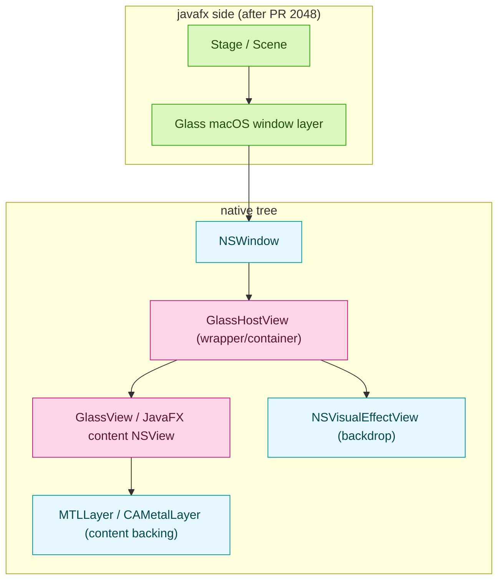
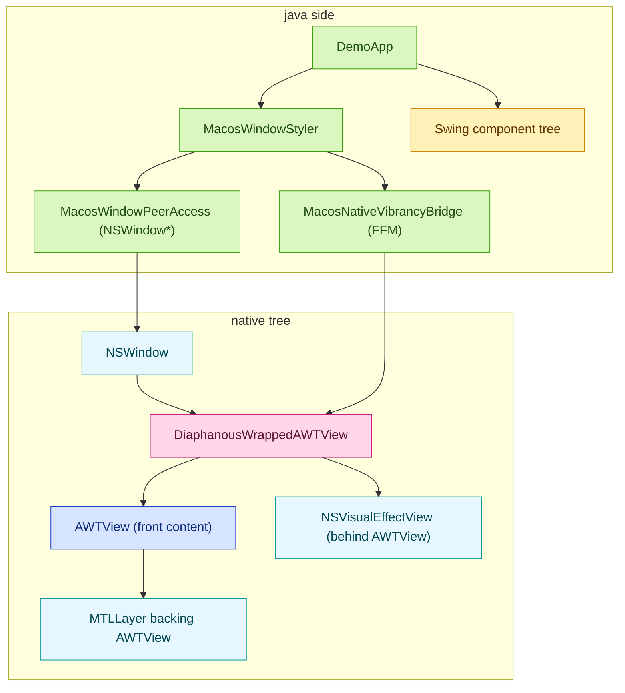

# Decorating with macOs vibrancy

## Summary

A native wrapper path was implemented and verified to insert `NSVisualEffectView` correctly behind the AWT host view in decorated mode.

The native tree tweak is not enough in practice for at least Swing apps because the panels are actually drawing on the buffer, and it needs to be cleaned to see the OS window.

## Why a native library was introduced?

From the Java side, the first approach was direct Objective-C runtime calls to:

1. resolve `NSWindow*`,
2. toggle `NSWindow`/`NSView` properties,
3. insert `NSVisualEffectView`.

That worked for window's property updates, but it did not provide a robust way to control native view ownership in decorated AWT windows.

In the native AppKit view hierarchy, the effect view must sit between `NSWindow` and the existing `AWTView` as a sibling-behind arrangement.

This native direction is inspired by [JavaFX PR 2048](https://github.com/openjdk/jfx/pull/2048), 
where the platform implementation installs an `NSVisualEffectView` in the native view chain so 
Java-rendered content stays in front while the system backdrop is behind.  
It's the same core idea but adapted to AWT native view (`AWTView`).

Before this the native structure had effectively this "tree":

```text
NSWindow
└── contentView: AWTView
```

In this structure, there is no stable parent container that owns both:

1. the original `AWTView` as front content, and
2. the `NSVisualEffectView` as backdrop behind content.

The missing piece is a native wrapper view that can be the new `contentView` and have both the original `AWTView` and the new `NSVisualEffectView` as children.:

1. create a stable wrapper around the existing AWT host view,
2. install/remove an effect view under that host view,
3. preserve AWT-specific selector/event behavior on the wrapper boundary.


### Why not using FFM for that?

FFM can handle part of this, but not cleanly for this case.

1. FFM is indeed great for calling C symbols and simple Objective-C runtime functions.
2. But this solution needs a real native `NSView` subclass (`DiaphanousWrappedAWTView`) with Objective-C methods (`mouseIsOver`, `deliverJavaMouseEvent:`), lifecycle, and ownership semantics.
3. Doing that from pure FFM would require dynamic Objective-C class creation, method injection with exact Objective-C ABI signatures, and careful upcall/trampoline lifetime handling.

So this is not impossible with FFM; it is possible but significantly higher risk and complex.
While a small `.mm` bridge provides stable Objective-C behavior while Java/FFM remains the orchestration layer.

## Implementation

1. New module for the native macOS helper project (`diaphanous-core-macos-native`).
2. This module will have a native wrapper content view (`DiaphanousWrappedAWTView`) that:
   - wraps the original `AWTView`,
   - inserts `NSVisualEffectView` behind it,
   - forwards AWT mouse selectors.
3. In `diaphanous-core` module a new FFM bridge (`MacosNativeVibrancyBridge`) to call native functions.


Additionally, in the demo app, two system properties were added to dump the structure:
- `-Ddiaphanous.dump.swing=true`
- `-Ddiaphanous.dump.native=true`

## Structure layout



For AWT here's the new component tree:



## Previous attempted approaches

1. Pure Java insertion:
   - resolved `NSWindow*` from AWT peer,
   - inserted `NSVisualEffectView` as a sibling under `contentView`,
   - applied material/state/alpha.
2. Java-side transparency tuning:¡
   - made Swing panels non-opaque,
   - cleared Swing panel backgrounds,
   - attempted peer opacity changes from Java.
3. Native wrapper path:
   - replaced `contentView` with `DiaphanousWrappedAWTView`,
   - moved original `AWTView` inside wrapper,
   - inserted `NSVisualEffectView` behind wrapped `AWTView`,
   - set non-opaque/clear background on window, wrapper, and AWT host layers.
4. Runtime dumps:
   - dumped Swing tree opacity/background state,
   - dumped native AppKit hierarchy and layer flags before and after vibrancy installation.
   - dumped native AppKit hierarchy and layer flags before and after vibrancy installation.

## What the hierarchy dump showed

Before install:

- `contentView` was directly `AWTView`.
- the window was opaque with a default light background.
- `AWTView` had an `MTLLayer`.

After install:

- the window became non-opaque with a clear background,
- the content view switched from `AWTView` to `DiaphanousWrappedAWTView`,
- `NSVisualEffectView` is present,
- the wrapped `AWTView` is non-opaque with a clear layer background,
- `AWTView` is still backed by `MTLLayer`.

> [!TIP]
> `MTLLayer` is a Metal-backed surface that can is used as a Java2D surface.
> The JDK has started to use it since Java 17, with the JEP 382 [Metal for Java](https://openjdk.java.net/jeps/382) ([`libawt_lwawt`](https://github.com/openjdk/jdk/tree/jdk-25%2B36/src/java.desktop/macosx/native/libawt_lwawt/java2d/metal)). 

This confirms The dump confirms the following:

1. Native wrapper installation is correct.
2. `NSVisualEffectView` is present and placed behind `AWTView`.
3. Window, wrapper, and `AWTView` are all configured as non-opaque.
4. `AWTView` remains backed by `MTLLayer`, and Swing/AWT still paints a full surface over the backdrop.

So the blocker is no longer native hierarchy setup. The blocker is the decorated AWT rendering pipeline (Metal-backed surface) covering the effect view.

<details>
  <summary>dumped properties (swing and native)</summary>

```text
- JRootPane visible=true opaque=false bg=rgba(238,238,238,255)
  - JLayeredPane visible=true opaque=false bg=rgba(238,238,238,255)
    - JPanel visible=true opaque=false bg=rgba(0,0,0,0)
      - RandomTimeseriesPanel visible=true opaque=false bg=rgba(238,238,238,255)
```

```text
[diaphanous] ---- window dump begin ----
[diaphanous] window=<AWTWindow_Normal ...> opaque=1 styleMask=0xf titlebarTransparent=0 bg=rgba(0.947, 0.947, 0.947, 1.000)
[diaphanous] contentView=<AWTView ...> class=AWTView
- AWTView ... opaque=0 wantsLayer=1 layer=<MTLLayer ...> layerOpaque=1 layerBg=nil
[diaphanous] ---- window dump end ----
```

```text
[diaphanous] ---- window dump begin ----
[diaphanous] window=<AWTWindow_Normal ...> opaque=0 styleMask=0x800f titlebarTransparent=1 bg=rgba(0.000, 0.000, 0.000, 0.000)
[diaphanous] contentView=<DiaphanousWrappedAWTView ...> class=DiaphanousWrappedAWTView
- DiaphanousWrappedAWTView ... opaque=0 wantsLayer=1 layer=<NSViewBackingLayer ...> layerOpaque=0 layerBg=rgba(0.000, 0.000, 0.000, 0.000)
  - NSVisualEffectView ... opaque=0 wantsLayer=0 layer=(null) layerOpaque=0 layerBg=nil
  - AWTView ... opaque=0 wantsLayer=1 layer=<MTLLayer ...> layerOpaque=0 layerBg=rgba(0.000, 0.000, 0.000, 0.000)
[diaphanous] ---- window dump end ----
```
</details>


## Digging into `MTLLayer` 

In modern macOS JDKs, Swing/AWT rendering is routed through the Metal pipeline. In this model, `AWTView` is backed by `MTLLayer`, and Java2D renders into an intermediate surface then copied to the layer for presentation.

Practical effect in this setup:

1. the effect view is present behind `AWTView`,
2. but the Metal-backed AWT content still presents a full frame over it,
3. so the backdrop blur is not visible even when the native hierarchy is correct.

The dump aligns with that model: after installation the tree is correct, and non-opaque flags are set, yet the displayed result stays flat gray.

> [!TIP]
> **What is blitting?**
> Blitting means copying already-rendered pixels from one buffer/surface to another display surface.
>
> In this context, Java rendering is first produced in an intermediate Java2D/Metal surface, then blitted into `MTLLayer`. If that blitted content fully covers the window region, views behind it (including `NSVisualEffectView`) cannot be seen.

## Dropped properties / Dropped assumptions

The following tuning properties are no longer considered effective for fixing decorated full-window vibrancy in this setup:

1. Swing panel `isOpaque=false` alone.
2. Clearing Swing panel backgrounds alone.
3. `NSWindow.setOpaque(false)` + clear `backgroundColor` alone.
4. `AWTView setOpaque(false)` alone.
5. `AWTView wantsLayer + clear layer background` alone.
6. `NSVisualEffectView.material` and alpha tuning alone.

These are still useful building blocks, but not sufficient to make decorated AWT content reveal a backdrop blur.

## Preventing Java overpaint on decorated windows

In earlier sections, the main remining issue: even with correct native wrapper insertion, AWT content (via `MTLLayer` blitting) was still painting a full surface over `NSVisualEffectView`.

That specific blocker is addressed by preventing background paint Java side in containers. In particular, the
frame content pane needs a special treatment to avoid full-surface overpaint:

```kotlin
private class RootErasingContentPane(
        layout: LayoutManager
) : JPanel(layout) {
   init {
      isOpaque = false
      background = Color(0, 0, 0, 0)
   }

   override fun paintComponent(g: Graphics) {
      if (!MacBackdropSupport.clearBackgroundIfEnabled(g, this)) {
         super.paintComponent(g)
      }
   }
}
```

Other containers like `JPanel` only need to be **not** opaque.

```kotlin
JPanel(layout).apply {
    isOpaque = false
}
```

Once the Swing container doesn't paint anymore, the window backdrop vibrancy/blur is visible.

Implemented outcomes:

1. For the root container the clearing support was added via `MacBackdropSupport` to avoid full-surface overpaint.
2. Erase activation is gated:
   - enabled for decorated macOS windows with `SYSTEM` / `VIBRANT_*` appearance,
   - disabled for undecorated mode and non-vibrant appearances (`AQUA`, `DARK_AQUA`).
3. Robot test coverage was extended to validate this activation path.
4. Demo controls now initialize from native defaults when available:
   - alpha slider from native `NSVisualEffectView.alphaValue`,
   - blur proxy slider from native `NSVisualEffectMaterial` (mapped to demo ranges).

Relation to previous findings:

1. Confirms the earlier conclusion that native hierarchy insertion is necessary but not sufficient.
2. Confirms that Java-side erase behavior is required to expose backdrop in decorated mode.
3. Keeps the same material limitation: material changes select blur profiles, not a direct blur-radius value.
